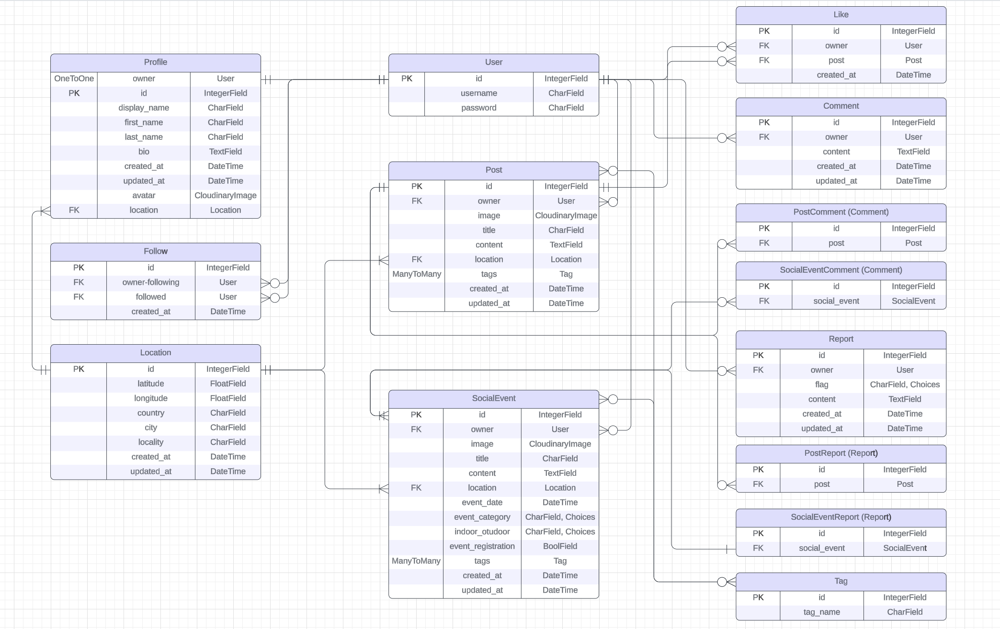

# Hoodsap API

Hoodsap API, developed using Django Rest Framework, is backend solution for neighborhood-based social networking applications. It's the core of the Hoodsap platform, which is a community-driven social network enabling users to engage with their local area through posts and events.

## Table of Contents

* [Agile Methodology](#agile-methodology)
* [Features](#features)
* [Database Design](#database-design)
* [Endpoints](#ui-/-ux)
* [Technologies Used](#technologies-used)
* [Testing](#testing)
* [Deployment](#deployment)
* [Credits](#credits)

## Agile Methodology

I've adopted Agile methodology for project planning, using GitHub Projects as the tool. Within the [project](https://github.com/users/fsjavier/projects/6), I've organized work into Epics to group user stories. Each user story includes a title, description, acceptance criteria, tasks, and tags to distinguish between "must have", "should have" and "could have" features. The workflow progresses from "To Do" to "In Progress" while working on user stories and finally to "Done" upon completion.

### User Stories

EPIC: Registration and Authentication
- https://github.com/fsjavier/hoodsap-api/issues/2 As a developer I want users to be able to log in and out (must-have)
- https://github.com/fsjavier/hoodsap-api/issues/4 As a developer I want to enable access to an API endpoint to obtain an refresh access token (must-have)
- https://github.com/fsjavier/hoodsap-api/issues/15 As a developer I want to enable users to register using their social accounts (could-have)

EPIC: User Profiles 
- https://github.com/fsjavier/hoodsap-api/issues/1 As a developer I want a new profile to be automatically created when a user register (must-have)
- https://github.com/fsjavier/hoodsap-api/issues/3 As a developer I want users to access all profiles but only be able to edit their own (must-have)

EPIC: Posts
- https://github.com/fsjavier/hoodsap-api/issues/5 As a developer I want users to be able to create, retrieve, update and delete their own posts (must-have)
- https://github.com/fsjavier/hoodsap-api/issues/11 As a developer I want to enable users to upload more than 1 image in a post (could-have)

EPIC: Social Events
- https://github.com/fsjavier/hoodsap-api/issues/6 As a developer I want users to be able to create, retrieve, update and delete their own events (must-have)

EPIC: Location
- https://github.com/fsjavier/hoodsap-api/issues/7 As a developer I want to add location functionality to be consumed by different parts of the application (profiles, posts, events) (must-have)

EPIC: Comments
- https://github.com/fsjavier/hoodsap-api/issues/8 As a developer I want to enable users to create, read, update and delete post comments if it's their own (must-have)
- https://github.com/fsjavier/hoodsap-api/issues/12 As a developer I want to enable users to create, read, update and delete social events comments if it's their own (must-have)

EPIC: Likes
- https://github.com/fsjavier/hoodsap-api/issues/9 As a developer I want to enable users to create, read and delete likes if it's their own (must-have)

Epic: Followers
- https://github.com/fsjavier/hoodsap-api/issues/10 As a developer I want to enable users to create, read and delete following if it's their own (must-have)

EPIC: Reports
- https://github.com/fsjavier/hoodsap-api/issues/13 As a developer I want to enable users to create, read, update and delete reports if it's their own (must-have)

EPIC: Tags
- https://github.com/fsjavier/hoodsap-api/issues/14 As a developer I want to enable users to create, read and delete tags for post and events if it's their own (must-have)

## Features

- User Registration and Authentication: Allows users to create accounts, log in and log out to access personalized features.
- Profile Management: Profiles are automatically created upon registration. Profiles can be updated including personal information and preferences.
- Location-Based Filtering: Posts and events are displayed based on user's geographical location.
- Posts Creation and Interaction: Users can create posts, like and comment on others posts.
- Events Creation: Allows users to create and discover local events.
- Followers and likes System: Users can follow each other and like each others' content.
- Tagging System: Posts and events can be tagged for better categorization and searchability.
- Content Reporting: Users have the possibility to flag posts and events if their content is suspicious.
- Privacy and Security: Ensures user data is protected and handled with privacy considerations in mind.

### Future Features

- Business Profiles and Services: Local businesses and freelancers can create profiles and list their services, connecting them with the neighborhood.

## Database Design

The applicatopn leverages a relational database structured around Django models. The relationships between the models are illustrated in the ERD:

- **Profile**: Contains user profiles with additional information like display name, avatar, and a link to a user's location data.
- **Location**: Stores geographical data with fields for latitude, longitude, country, city, and locality. It's referenced by the Profile, Post and SocialEvent models to facilitate location-based filtering.
- **Post**: Represents user-generated content with fields for images, titles, and content. It includes a foreign key to User for ownership, a link to the Location model, and a many-to-many relationship with the Tag model for categorization.
- **SocialEvent**: Similar to posts but specifically for events, containing details about the event. It' also connected to User, Location and Tag.
- **Comment, Report**: Manage commenting on posts or events and reporting content, each linking back to the User and the content (Post or SocialEvent).
- **Tag**: Used for categorizing posts and social events, featuring a simple model with just a name for each tag.
- **Like, Follow**: These models manage user interactions such as liking posts and following other users, tracking the relationships.

