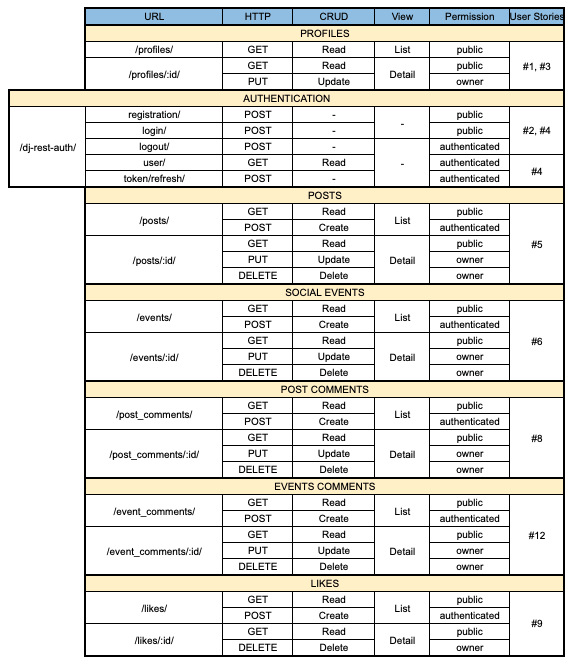
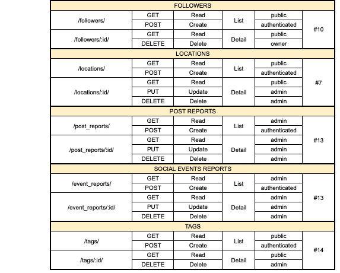

# Hoodsap API

Hoodsap API, developed using Django Rest Framework, is backend solution for neighborhood-based social networking applications. It's the core of the Hoodsap platform, which is a community-driven social network enabling users to engage with their local area through posts and events.

## Table of Contents

* [Agile Methodology](#agile-methodology)
* [Features](#features)
* [Database Design](#database-design)
* [Endpoints](#ui-/-ux)
* [Technologies Used](#technologies-used)
* [Testing](#testing)
* [Deployment](#deployment)
* [Credits](#credits)


## Agile Methodology

I've adopted Agile methodology for project planning, using GitHub Projects as the tool. Within the [project](https://github.com/users/fsjavier/projects/6), I've organized work into Epics to group user stories. Each user story includes a title, description, acceptance criteria, tasks, and tags to distinguish between "must have", "should have" and "could have" features. The workflow progresses from "To Do" to "In Progress" while working on user stories and finally to "Done" upon completion.

### User Stories

EPIC: Registration and Authentication
- https://github.com/fsjavier/hoodsap-api/issues/2 As a developer I want users to be able to log in and out (must-have)
- https://github.com/fsjavier/hoodsap-api/issues/4 As a developer I want to enable access to an API endpoint to obtain an refresh access token (must-have)
- https://github.com/fsjavier/hoodsap-api/issues/15 As a developer I want to enable users to register using their social accounts (could-have)

EPIC: User Profiles 
- https://github.com/fsjavier/hoodsap-api/issues/1 As a developer I want a new profile to be automatically created when a user register (must-have)
- https://github.com/fsjavier/hoodsap-api/issues/3 As a developer I want users to access all profiles but only be able to edit their own (must-have)

EPIC: Posts
- https://github.com/fsjavier/hoodsap-api/issues/5 As a developer I want users to be able to create, retrieve, update and delete their own posts (must-have)
- https://github.com/fsjavier/hoodsap-api/issues/11 As a developer I want to enable users to upload more than 1 image in a post (could-have)

EPIC: Social Events
- https://github.com/fsjavier/hoodsap-api/issues/6 As a developer I want users to be able to create, retrieve, update and delete their own events (must-have)

EPIC: Location
- https://github.com/fsjavier/hoodsap-api/issues/7 As a developer I want to add location functionality to be consumed by different parts of the application (profiles, posts, events) (must-have)

EPIC: Comments
- https://github.com/fsjavier/hoodsap-api/issues/8 As a developer I want to enable users to create, read, update and delete post comments if it's their own (must-have)
- https://github.com/fsjavier/hoodsap-api/issues/12 As a developer I want to enable users to create, read, update and delete social events comments if it's their own (must-have)

EPIC: Likes
- https://github.com/fsjavier/hoodsap-api/issues/9 As a developer I want to enable users to create, read and delete likes if it's their own (must-have)

Epic: Followers
- https://github.com/fsjavier/hoodsap-api/issues/10 As a developer I want to enable users to create, read and delete following if it's their own (must-have)

EPIC: Reports
- https://github.com/fsjavier/hoodsap-api/issues/13 As a developer I want to enable users to create, read, update and delete reports if it's their own (must-have)

EPIC: Tags
- https://github.com/fsjavier/hoodsap-api/issues/14 As a developer I want to enable users to create, read and delete tags for post and events if it's their own (must-have)

## Features

- User Registration and Authentication: Allows users to create accounts, log in and log out to access personalized features.
- Profile Management: Profiles are automatically created upon registration. Profiles can be updated including personal information and preferences.
- Location-Based Filtering: Posts and events are displayed based on user's geographical location.
- Posts Creation and Interaction: Users can create posts, like and comment on others posts.
- Events Creation: Allows users to create and discover local events.
- Followers and likes System: Users can follow each other and like each others' content.
- Tagging System: Posts and events can be tagged for better categorization and searchability.
- Content Reporting: Users have the possibility to flag posts and events if their content is suspicious.
- Privacy and Security: Ensures user data is protected and handled with privacy considerations in mind.

### Future Features

- Business Profiles and Services: Local businesses and freelancers can create profiles and list their services, connecting them with the neighborhood.


## Database Design

The applicatopn leverages a relational database structured around Django models. The relationships between the models are illustrated in the ERD:


- **Profile**: Contains user profiles with additional information like display name, avatar, and a link to a user's location data.
- **Location**: Stores geographical data with fields for latitude, longitude, country, city, and locality. It's referenced by the Profile, Post and SocialEvent models to facilitate location-based filtering.
- **Post**: Represents user-generated content with fields for images, titles, and content. It includes a foreign key to User for ownership, a link to the Location model, and a many-to-many relationship with the Tag model for categorization.
- **SocialEvent**: Similar to posts but specifically for events, containing details about the event. It' also connected to User, Location and Tag.
- **Comment, Report**: Manage commenting on posts or events and reporting content, each linking back to the User and the content (Post or SocialEvent).
- **Tag**: Used for categorizing posts and social events, featuring a simple model with just a name for each tag.
- **Like, Follow**: These models manage user interactions such as liking posts and following other users, tracking the relationships.


## Endpoints




## Technologies used

The project is developed in Python.

### Frameworks

- Django and Django REST Framework to create the web API.

### Libraries and Packages

- Gunicorn to handle web requests.

- Dj-Database-URL to configure the database management.

- Django-CORS-Headers to handle the server headers required for Cross-Origin Resource Sharing (CORS).

- Django Filters to allow users filtering querysets dynamically.

- Pillow for image processing.

- Psycopg2 as an adapter used for database connectivity.

- PyJWT to encode and decode JSON Web Tokens (JWT).

- Django Allauth and Dj-Rest-Auth to handle user authentication, registration, and account management.

### Database

- ElephantSQL as the PostgreSQL database used in production.

### Hosting

- Heroku to host and deploy the appliocation.

### Other Technologies
- Git for version control.

- GitHub to host the code.

- Cloudinary to manage media assets.

- Gitpod as the IDE used to develop the website.

- Lucidchart to create the ERD.


The [requirements.txt](requirements.txt) file specifies the full list of packages and their versions of these packages.


## Deployment

This site has been deployed to Heroku, using ElephantSQL database and Cloudinary, following these steps:

1. Installing Django and supporting libraries

    - Install Django, Djangorestframework (and add it to installed apps in settings.py) and gunicorn
    - Install supporting database libraries: dj_database_url and psycopg2
    - Install Cloudinary libraries: dj-cloudinary-storage
    - Install Pillow
    - Create requirements file
    - Create Django project
    - Create first app
    - Add app to installed apps in settings.py file
    - Migrate changes
    - Run the server to test if the app is installed

2. Create the Heroku App
    - Log into Heroku and go to the Dashboard
    - Click “New" and then “Create new app”
    - Choose an app name and select the region closest to you. Then, click “Create app” to confirm.

3. Create an external database with ElephantSQL

    - Log into ElephantSQL
    - Click "Create New Instance"
    - Set up a plan by giving a Name and selecting a Plan
    - Click "Select Region" and choose a Data center
    - Click "Review", check all details and click "Create Instance"
    - Return to the Dashboard and click on the database instance name
    - Copy the database URL

4. Create an env.py file to avoid exposing sensitive information

    - In the project workspace, create a file called env.py. Check that the file name is included in the .gitignore file
    - Add ``import os`` to env.py file and set environment variable DATABASE_URL to the URL copied from ElephantSQL ``os.environ["DATABASE_URL"]="<copiedURL>"``
    - Add a SECRET_KEY environment variable ``os.environ["SECRET_KEY"]="mysecretkey"``

5. Upate settings.py

    - Add the following code below the path import in ``settings.py`` to connect the Django project to env.py:
        ````
        import os
        if os.path.exists("env.py"):
            import env
        ````
    - Remove the secret key provided by Django in settings.py and refer to variable in env.py instead (``SECRET_KEY = os.environ.get('SECRET_KEY')``)

    - In order to keep using the sqlite database in the development environment as well as as having Debug on, but off in production and use the ElephantSQL database, create a new variable called DEV at the top of settings.py. This means that if there's an environment variable called DEV in the environment this variable will be set to its value. And otherwise, it'll be false. 
        ````
        development = os.environ.get('DEV', False)
        ````

    - To connect to the new database for production and keep sqlite for development, replace the provided DATABASE variable with 
        ````
        if development:
            DATABASES = {
                'default': {
                    'ENGINE': 'django.db.backends.sqlite3',
                    'NAME': BASE_DIR / 'db.sqlite3',
                }
            }
        else:
            DATABASES = {
                'default': dj_database_url.parse(os.environ.get('DATABASE_URL'))
            }
        ````
    - Save and migrate all changes

6. Heroku Config Vars

    - Go back to Heroku dashboard and open the Settings tab
    - Add config vars
        - DATABASE_URL -> value of the database url
        - SECRET_KEY -> value of the secret key string
        - DISABLE_COLLECTSTATIC -> 1
        - ALLOWED_HOSTS -> value of the deployed Heroku app url

7. Set up Cloudinary for static and media files storage

    - In the Cloudinary dashboard, copy the API Environment variable
    - In ``env.py`` file, add new variable ``os.environ["CLOUDINARY_URL"] = "<copied_variable"``, without "CLOUDINARY_URL="
    - Add the same variable value as new Heroku config var named CLOUDINARY_URL
    - In ``settings.py``, in the INSTALLED_APPS list, above ``django.contrib.staticfiles`` add ``cloudinary_storage``, below add ``cloudinary``
    - Connect Cloudinary to the Django app in settings.py:

        ````
        CLOUDINARY_STORAGE = {
            'CLOUDINARY_URL': os.environ.get('CLOUDINARY_URL')
        }
        MEDIA_URL = '/media/'
        DEFAULT_SITE_STORAGE = 'cloudinary_storage.storage.MediaCloudinaryStorage'
        ````

    - Add Heroku Hostname to ALLOWED_HOSTS

        ````
        if development:
            ALLOWED_HOSTS = [os.environ.get('LOCALHOST')]
        else:
            ALLOWED_HOSTS = [os.environ.get('HEROKU_HOSTNAME')]
        ````

8. Add JWT to the project
    - Install `dj-rest-auth` and `dj-rest-auth[with_social]`
    - Add to installed apps in settings.py
        ````
        'rest_framework.authtoken',
        'dj_rest_auth',
        'django.contrib.sites',
        'allauth',
        'allauth.account',
        'allauth.socialaccount',
        'dj_rest_auth.registration',
        ````
    - Install `djangorestframework-simplejwt`
    - Add authentication method to settings.py:
        ````
        REST_FRAMEWORK = {
            'DEFAULT_AUTHENTICATION_CLASSES': [(
                'rest_framework.authentication.SessionAuthentication'
                if 'DEV' in os.environ
                else 'dj_rest_auth.jwt_auth.JWTCookieAuthentication'
            )],
        }
        ````
        ````
        REST_USE_JWT = True
        JWT_AUTH_SECURE = True
        JWT_AUTH_COOKIE = 'my-app-auth'
        JWT_AUTH_REFRESH_COOKIE = 'my-refresh-token'
        JWT_AUTH_SAMESITE = None
        ````

9. Create Procfile

10. Heroku Deployment:

    - Click Deploy tab in Heroku
    - In the 'Deployment method' section select 'Github' and click 'Connect to Github'
    - In the 'search' field enter the repository name
    - Connect to link the heroku app with the Github repository
    - Click "Deploy Branch" or enable "Automatic Deploys"


## Credits

The structure of the project, especially project set up and the posts, profiles, likes, comments and followers apps, is based on Code Institute's Django REST Framework project ([drf-api](https://github.com/Code-Institute-Solutions/drf-api)).

